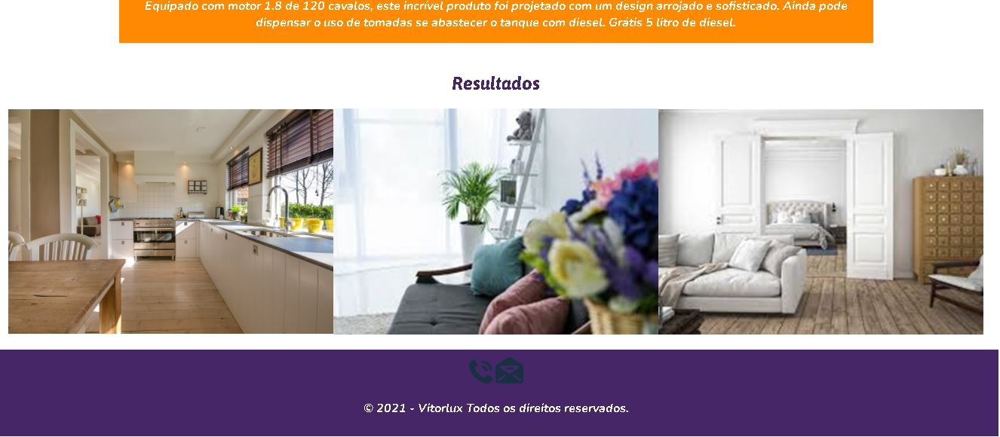

 

 

 

 

     
                 
## 💻 Projeto

Empresa fictícia que vende aspiradores de pó, portátil , a diesel e de ultimas gerações.

## 👨🏼‍💻 Desenvolvedor 

- [Gabriel de Souza](https://www.linkedin.com/in/gabriel-ti/)

## 💻 Tecnologias

Esse projeto foi desenvolvido com as seguintes tecnologias:

- [HTML5]
- [CSS3]